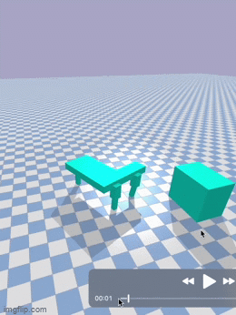

# DockBot

## Introduction
Created using [Ludobots course](https://www.reddit.com/r/ludobots/wiki/installation/).

## Motivation
This is an asymmetrical robot, created to simulate the behavior shown in this [video](https://youtu.be/UeAzWnlgWWE). This robot is built to have asymmetric morphology so that its locomotion is curvilinear. Thus, the hope is that when two such robots move together, their paths complement each other and the whole robot moves together in a straight line. This will be an example of creating new heirarchical behavior.

## Plan
The first step of this process is to build a robot that can move towards a particular point, as shown in the image below.

## Current Work

## Next Steps
The code in this branch of my repository is successful in getting the robot to detect the docking station and move towards it, however does not yet dock. The next steps will be to add photo sensors to aid in docking, then duplicating the robot so that both robots dock into each other, and finally modifying the fitness function to achieve linear motion.
